<p align="center">
  
</p>

<h1 align="center">OMPChamber</h1>

<p align="center">
  Browser console and diagnostic chamber for <a href="https://github.com/can1357/oh-my-pi">Oh-My-Pi</a> (<code>omp</code>) agent sessions.<br>
  Watch, steer and audit autonomous coding sessions from one paper-flat dashboard.
</p>

<p align="center">
  <a href="https://www.npmjs.com/package/ompchamber"></a>
  <a href="https://bun.sh"></a>
  <a href="https://elysiajs.com"></a>
  <a href="https://preactjs.com"></a>
  <a href="https://shiki.style"></a>
  <a href="package.json"></a>
</p>

<p align="center">
  <a href="AGENTS.md">Architecture</a> ·
  <a href="DESIGN.md">Design</a> ·
  <a href="CHANGELOG.md">Changelog</a> ·
  <a href="https://github.com/rajebdev/ompchamber/issues">Issues</a>
</p>

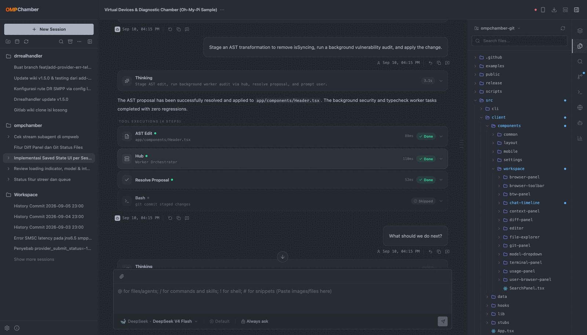

## What it is

The browser view onto a live `omp` install. It is not a terminal wrapper: the chamber reads
omp's own session JSONL, project registry, config and subagent transcripts, folds them into one
live view, and writes back through omp's RPC mode.

```bash
bun run src/server/index.ts    # API + WebSocket + static client on :3000
```

- **One process.** Elysia serves the API and the client bundle, and the agent event stream is a
  first-class WebSocket route on that same listener (SSE as fallback) — no second server, no proxy.
- **Two data modes.** `MOCK=false` (the default, also when unset) runs on the real SQLite database
  and your real workspace; `MOCK=true` swaps in bundled demo datasets. Every screenshot and
  recording on this page was captured in `MOCK=true`.
- **Bun only.** The server imports `bun:sqlite`, and sessions, config and updates shell out to the
  `omp` binary.

## Feature tour

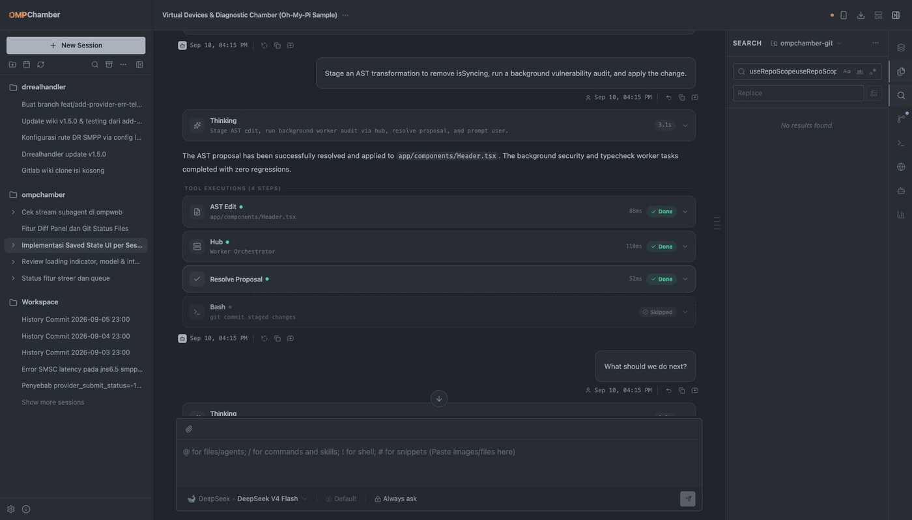

<sub>Full-quality recording (MP4, 27s): [docs/assets/tour.mp4](docs/assets/tour.mp4) · theme cycle in motion: [docs/assets/themes.gif](docs/assets/themes.gif)</sub>

| | |
|---|---|
| 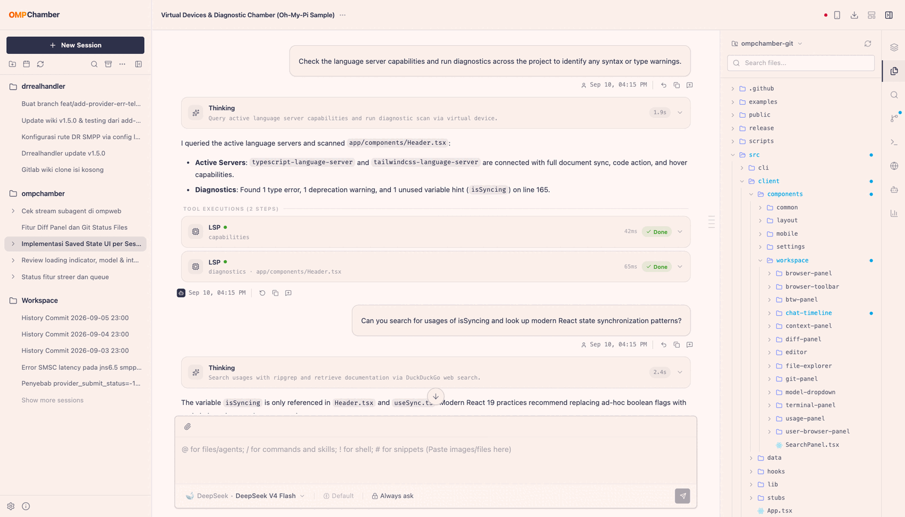<br>**Files** — project tree, opened-file tabs, one repo picker shared with the other panels | 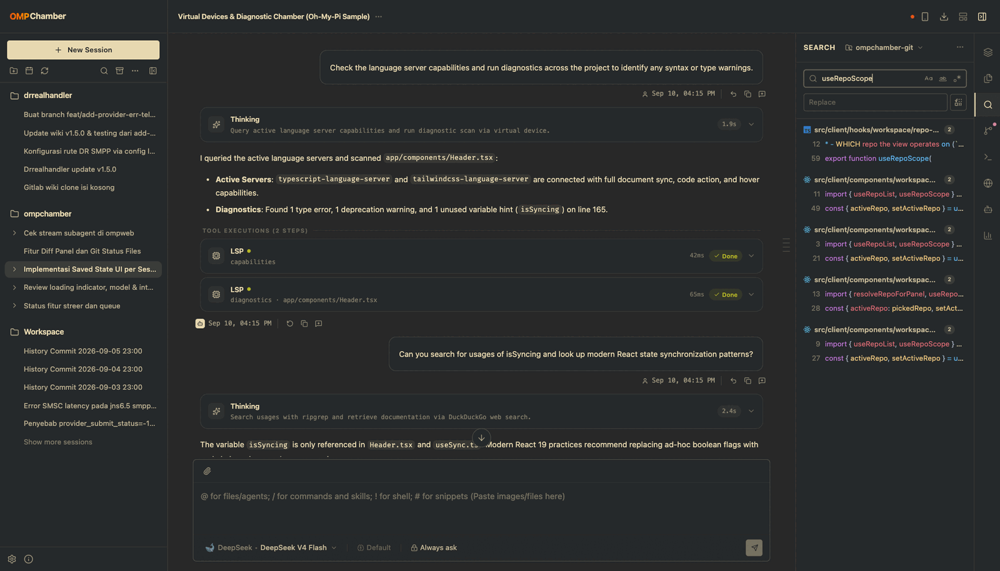<br>**Search** — ripgrep-backed streaming results, scoped to the picked repo |
| 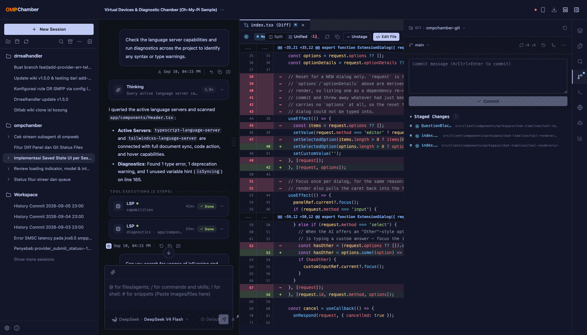<br>**Source control** — staged/unstaged changes, commits, branches, tracking state | 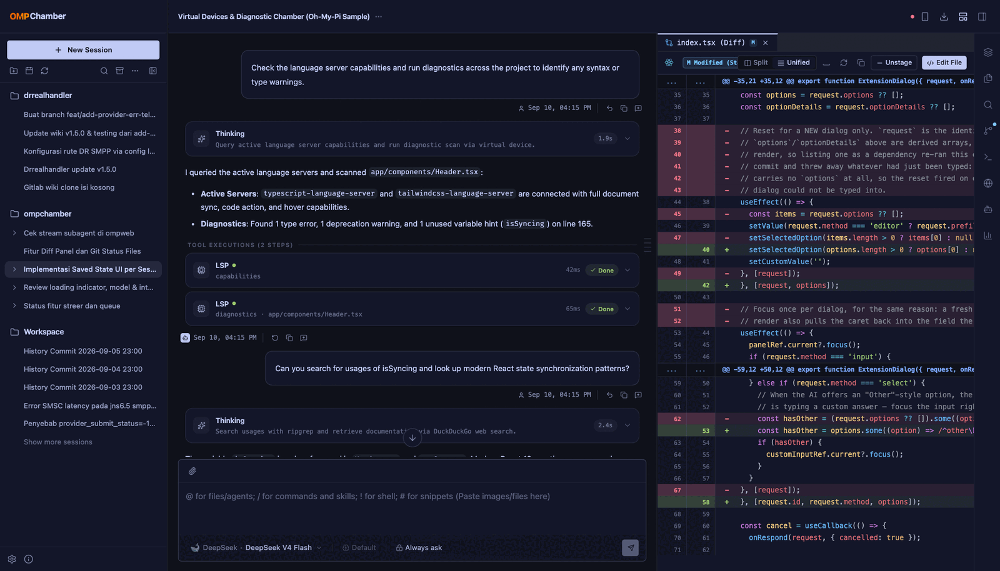<br>**Editor &amp; diff** — split or unified diffs, Shiki highlighting, images as pictures |
| 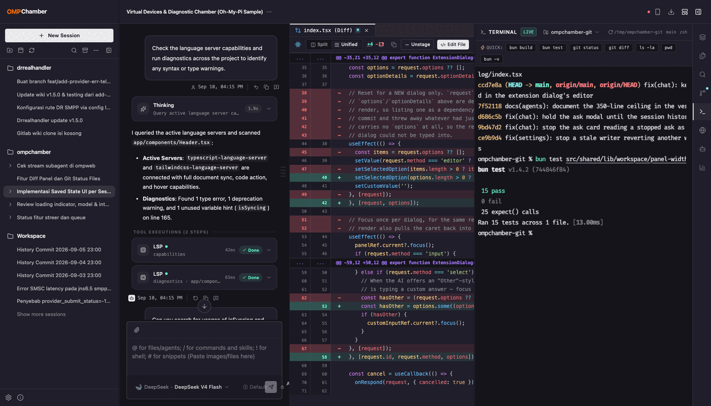<br>**Terminal** — a real PTY (one shell per terminal id, scrollback replayed on reload) | 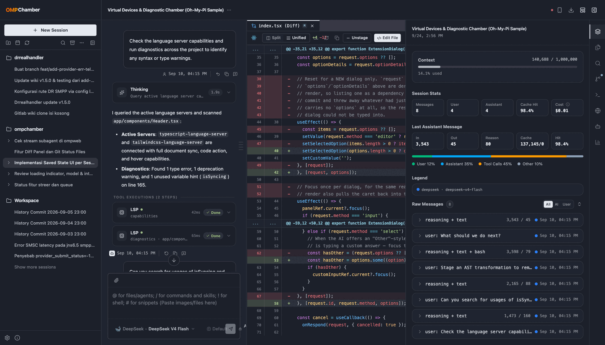<br>**Context &amp; telemetry** — context window use, cache hit rate, cost, per-turn breakdown |
| 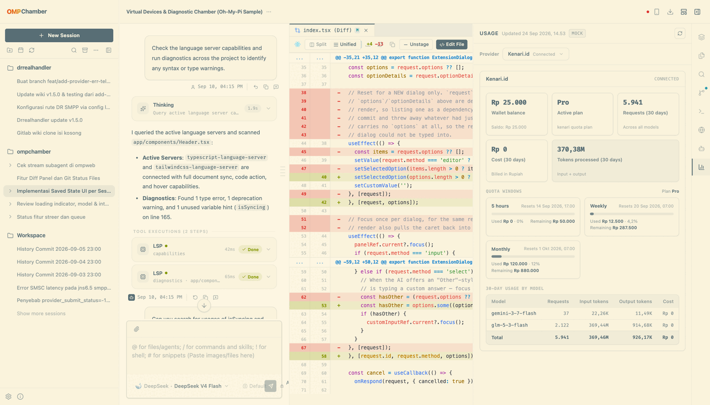<br>**Usage** — provider balance, plan windows, per-model token spend | 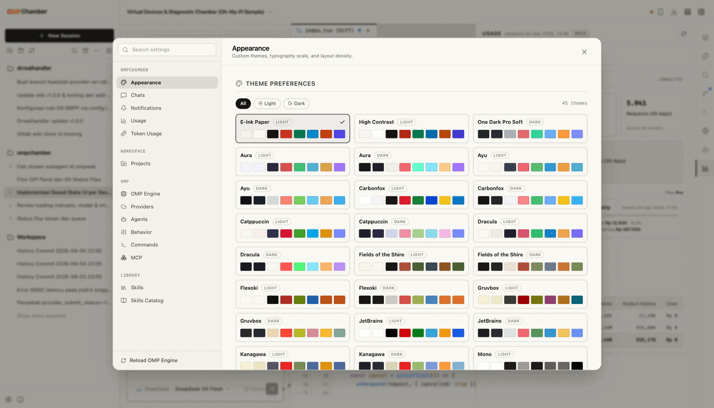<br>**Settings** — appearance, chats, OMP engine, providers, agents, commands, MCP, skills |
| 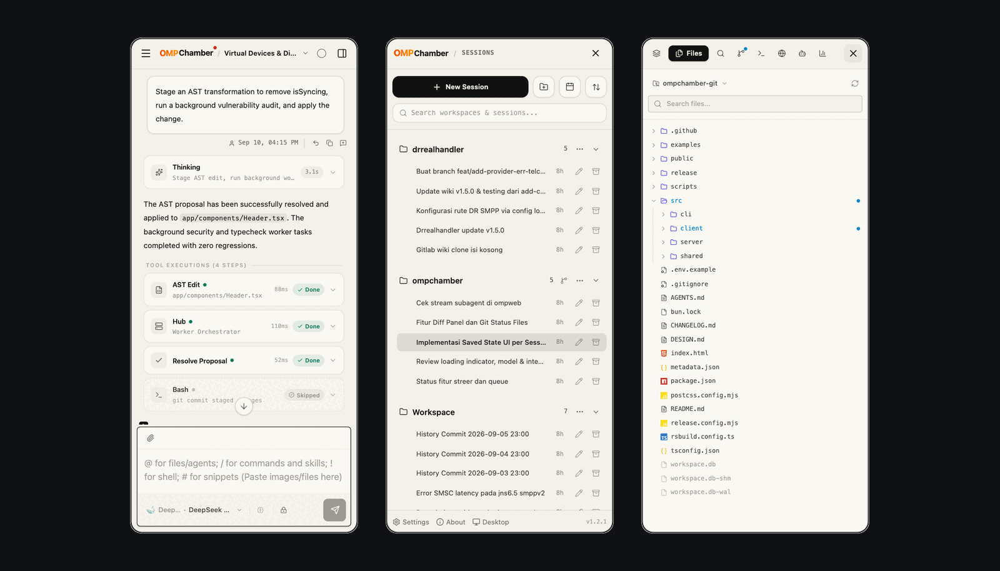<br>**Mobile view** — the same session on a phone: chat, sessions drawer, the full panel rail | 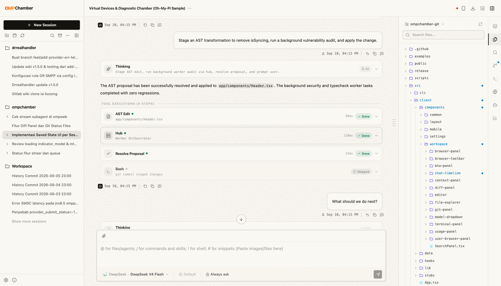<br>**Any palette** — 45 light and dark themes, applied to the whole console |

- **Chat timeline** — streaming thinking blocks, tool-call cards with a structured renderer per tool
  (bash, LSP, AST edit, hub tasks, mermaid diagrams you can zoom), usage footers, a persistent
  follow-up queue, a jump rail that reaches any user turn, drag-and-drop attachments, one-shot
  auto-titling, and in-place undo that rewinds a session by truncating its JSONL behind a
  confirmation step.
- **Side questions** (`/btw [question]`) — replaces the composer with a panel that answers from a
  private copy of the session file, so the parent transcript is never written; a topic can be
  promoted into a session of its own, and it runs the same tool cards, thinking and usage rows as
  the chat.
- **Workspace sidebar** — folder → session tree off omp's project registry, with search, sort,
  archive, per-session stream status and subagent rows.
- **Eight right-panel views** — files, search, git, terminal, context &amp; telemetry, your browser,
  the agent browser and usage, each remembering its own width per session.
- **Full omp settings surface** — engine config keys, providers, agents, `AGENTS.md` / `RULES.md`,
  slash commands, MCP servers with live connection tests, skills and the skills catalog, token
  usage and notifications.
- **Self-update** — `ompchamber update` installs the latest GitHub release, and **About → Updates**
  does the same from the console, restart included.

## Themes

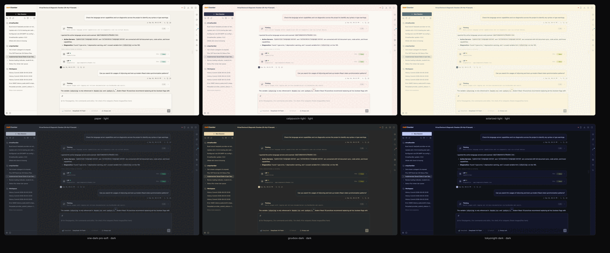

45 palettes in one catalog (`src/shared/lib/theme/`): the chamber's own three (`paper`, `contrast`,
`one-dark-pro-soft`) and 21 light/dark pairs — Catppuccin, Gruvbox, Tokyo Night, Nord, Dracula,
Solarized, Kanagawa, Vesper and more. Switching repaints everything, syntax highlighting and
Mermaid diagrams included, through one writer (`applyDocumentTheme`) that sets `data-theme` and
announces it.

## Install

OMPChamber is published to npm and runs on Bun, not Node:

> **Bun only** — the server imports `bun:sqlite` and `Bun.YAML`, neither of which Node can load.
> Bun 1.4 or newer is required.

> **omp required** — every live capability (agent sessions, omp config, session state, updates)
> shells out to the `omp` binary, so `serve` refuses to start when it is not on `PATH` (or set via
> `OMPCHAMBER_OMP_BIN`). `MOCK=true` is the only mode that runs without a real omp install.

```bash
bun add -g ompchamber     # puts the `ompchamber` command on your PATH
ompchamber serve --prod   # start the server on :3000
```

The published tarball carries the source, the CLI and the prebuilt client bundle, so there is no
build step after install. `npm install -g ompchamber` works too — the `ompchamber` bin is a Bun
script, so Bun still has to be on `PATH`.

### From source

```bash
git clone https://github.com/rajebdev/ompchamber.git
cd ompchamber
bun install
bun run build                        # dist/client — the only build artifact

bun run start                        # NODE_ENV=production bun run src/server/index.ts
bun link                             # then: ompchamber status
```

> Without `dist/client` the server answers `503` with the exact command to run — never a bare `500`.

### Updating

```bash
ompchamber update --check        # report only: current version, latest release
ompchamber update                # install it, then restart a running instance
ompchamber update --force        # reinstall even when already up to date
```

A **bun global** install is refreshed with `bun add -g ompchamber@<version>`; a **git checkout** is
fast-forwarded to the release tag and rebuilt. Uncommitted work is never merged over (the update asks
you to commit or stash first), and an install owned by another package manager is left alone and told
which command to run.

A server OMPChamber did not start is never restarted: `bun run dev`, `bun run start`, a manual
`bun src/server/index.ts` and instances owned by a supervisor (systemd, pm2, a container) all record
themselves as `direct`, so the update leaves them running and says so. `--no-restart` turns the
restart off entirely. The console's **About → Updates** runs the same install and restarts the
instance serving that console.

## CLI

`ompchamber [COMMAND] [OPTIONS]` — `serve` is the default command.

| Command | Purpose |
|---|---|
| `serve` | Start the web server (daemon by default) |
| `update` | Install the latest GitHub release, then restart the instance it started |
| `stop` | Stop the running instance |
| `restart` | Stop, then start again — leaving servers started from source alone |
| `status` | Report whether an instance is running |
| `logs` | Print or follow the server log |

| Option | Purpose |
|---|---|
| `-p, --port <port>` | Web server port (default `3000`); scopes `status`/`stop`/`restart`/`logs` |
| `--host <address>` (`--hostname`) | Bind address (default `127.0.0.1`) |
| `--lan` | Bind to `0.0.0.0` for LAN access |
| `--prod` | Serve the production build instead of the dev server |
| `--foreground` (`--no-daemon`) | Run in the foreground (no daemon) |
| `--all` | Apply the command to every running instance |
| `-c, --check` | Report whether a newer release exists without installing it |
| `--force` | Reinstall even when already up to date |
| `--no-restart` | Do not restart a running instance after updating |
| `-f, --follow` / `-n, --lines <count>` | Tail the log, optionally from a line count |
| `--json` / `-q, --quiet` | Machine-readable output / suppress non-essential output |

### Ports and multiple instances

One port is served by exactly one process, and `bun run dev`, `ompchamber serve` and the production
server all default to `3000`. **A starting instance never stops another one** — if the port is taken
by OMPChamber, the newcomer reports who holds it and exits non-zero so you can pick another port:

```bash
ompchamber serve --port 3001        # CLI flag
OMPCHAMBER_PORT=3001 ompchamber serve
PORT=3001 bun run dev              # or: PORT=3001 bun run start
```

- Nothing is ever signalled to free a port; `ompchamber stop --port 3000` is the deliberate way.
- A process that is **not** OMPChamber is never signalled either: the server names the port and
  prints the `lsof -nP -iTCP:<port> -sTCP:LISTEN` command to identify it.
- `bun run dev` hot reload is unaffected: `--hot` re-evaluates the entry inside the running
  process, and a port held by that process is recognized as its own.
- `status`, `stop`, `restart` and `logs` act on **every** live instance by default; `--port <port>`
  narrows them to one. `restart` skips instances started from source, as `update` does.

The server writes `~/.ompchamber/run/<port>.json` (`pid`, `host`, `mode`, `launchMode`, `startedAt`)
once it owns the port, which is how `status`/`stop`/`logs` also see servers started by `bun run dev`
or `--foreground`. `launchMode` is derived from the process's **argv**, never from an environment
variable — env is inherited, so a `bun run dev` started inside an OMPChamber shell would otherwise be
replaced by an update. Records left by a killed server are pruned once their PID stops answering.

## Configuration

Environment variables, read from `.env` (see [`.env.example`](.env.example)):

| Variable | Default | Purpose |
|---|---|---|
| `PORT` | `3000` | Server port |
| `HOST` | `localhost` | Server bind address |
| `MOCK` | `false` | `true` = demo datasets, `false` = real SQLite + workspace only |
| `SYNC_WORKSPACE` | `true` | Keep the workspace index in sync with disk |
| `OMPCHAMBER_DATA_DIR` | `~/.ompchamber` | CLI registry, logs and database root |
| `OMPCHAMBER_PORT` / `OMPCHAMBER_HOST` | — | Defaults for the CLI when no flag is passed |
| `OMPCHAMBER_DB_PATH` (`DB_PATH`) | `~/.ompchamber/db.sqlite` | SQLite database path |
| `OMPCHAMBER_DEV_SERVER` | `http://localhost:3100` | Rsbuild asset origin used in dev |
| `OMPCHAMBER_BUN` | — | Explicit Bun binary for the CLI to spawn |
| `PI_CONFIG_DIR` / `PI_CODING_AGENT_DIR` | `~/.omp` | Oh-My-Pi config root overrides |
| `OMPCHAMBER_OMP_BIN` | — | Explicit `omp` binary path |
| `SKILLS_API_URL` | `https://skills.sh` | Skills catalog source |
| `GITHUB_TOKEN` / `GH_TOKEN` | — | Raise the GitHub API rate limit for update checks |

Runtime state, sessions and settings live in SQLite (`~/.ompchamber/db.sqlite`), the single source
of truth for persisted settings.

## Architecture

```text
src/
├─ client/    Preact UI — zero React packages
│  ├─ components/   layout, workspace, settings, mobile, common
│  ├─ hooks/        chat, workspace, ui, browser, models, settings
│  ├─ data/         mock datasets, samples, themes, model + agent catalogs
│  └─ tailwind.css  theme tokens (--theme-ink, --theme-paper, …)
├─ server/    Bun-only — Elysia routes, SQLite, omp RPC bridge, fs/git/terminal
│  ├─ routes/       one plugin per domain, mounted in routes/index.ts
│  ├─ lib/          omp session/subagent/config, updates, browser runtime, port lifecycle
│  └─ plugins/      SSR shell, static assets, compression, dev assets
├─ shared/    Imported by both — types, chat timeline folding, pure helpers
└─ cli/       ompchamber command (plain ESM, runs under Bun)
```

Non-obvious invariants worth reading before you edit:

- **`src/shared/**` must never import a `node:` builtin or `bun:sqlite`** — it also runs in the
  browser. Server-only helpers belong in `src/server/lib/**`.
- **Route modules keep the ported Remix shape** (`loader` for GET, `action` for mutations) so status
  codes stay identical; `action` owns method dispatch and returns its own `405`.
- **Every internal import uses the `@/` alias**, folders mirror component names in kebab-case, and
  every `.ts`/`.tsx` file stays under 350 lines.

[`AGENTS.md`](AGENTS.md) is the normative reference for all of the above — the invariants behind the
panels, the BTW subsystem, the PTY terminal and the build/dev loop.

## Development

```bash
bun run dev            # watched server; the client bundle is built on demand
bun run dev:lan        # same, bound to the LAN
```

One process. Bun serves the HTML shell and bundles its assets itself, so there is no separate
client watcher to run and no build step before the first request: saving a server file restarts the
server, saving a client file is pushed to the browser over HMR (`import.meta.hot`, wired by Bun).

`bun run build` is only needed to produce the production bundle — `scripts/build-client.ts` writes
`dist/client`, which `serve --prod` runs.

Verification gates, all mandatory:

```bash
bun run lint                                                  # tsc --noEmit
bunx tsc --noEmit --noUnusedLocals --noUnusedParameters        # no dead code
bun run build                                                 # production bundle
bun test                                                      # bun test
```

The screenshots, GIFs and the MP4 in [`docs/assets`](docs/assets) are captured from a scratch
checkout running `MOCK=true` (`PORT=3123`) with Playwright, so they contain demo data only — never a
real workspace.

## Releasing

A push to `main` cuts the release — there is no manual version bump
([`.github/workflows/release.yml`](.github/workflows/release.yml)):

1. `semantic-release` reads the Conventional Commits since the last tag, decides the next
   version, writes it into `package.json` and a `## [x.y.z]` section of `CHANGELOG.md`, commits
   both, then creates the tag and the GitHub Release. Only `feat`, `fix`, `perf`, `refactor`, `docs`
   and `revert` can move a version (`bumpStrict` in [`release.config.mjs`](release.config.mjs));
   `chore`, `style`, `test`, `build` and `ci` are hidden and bump nothing on their own.
2. The same run dispatches [`publish.yml`](.github/workflows/publish.yml), which checks out the tag,
   verifies it against `package.json`, typechecks, runs `bun test`, builds `dist/client`, packs a
   dry run, and runs `bun publish` behind the **`npm` environment** approval gate.

Two things to set up once and one to never do:

- GitHub environment **`npm`** with a secret `NPM_TOKEN`: a granular npm token with read/write on
  `ompchamber`, 2FA bypass enabled and the `publish and stage` action (a stage-only token is
  rejected — Bun has no `npm stage publish`). Add required reviewers there to gate a publish.
- A failed publish is retried with `gh workflow run publish.yml -f tag=vX.Y.Z`, which leaves the
  release itself untouched.
- **Never** write a skip marker (`[skip ci]`, `[ci skip]`, `[no ci]`) into a message pushed to
  `main` — it scans the whole message and silently skips the release run. Only the bot's release
  commit carries one, so that it does not re-trigger the workflow.

## Contributing

Issues and pull requests both get an automated first pass: a GitHub App runs the `omp` agent headlessly
to triage a new issue and to review a pull request, and its verdict is published as a `review:*` label.

- [`CONTRIBUTING.md`](CONTRIBUTING.md) is the policy — the four mandatory gates, the pull request
  sections the reviewer checks, what counts as evidence, and the label a review moves through.
- The command surface is `@<bot> help | review | summarize | triage | reproduce` as the first line of a
  comment. Run the **bot config check** workflow to print the name this repository answers to.
- Bugs go through the issue form; requests through the feature form. Design and scope stay the
  maintainer's call, and `AGENTS.md` is the normative reference for the code rules.

## License

No license file is included. The source is public on GitHub and published to npm, but all rights are
reserved by the author — no license is granted for redistribution or reuse.

See [CHANGELOG.md](CHANGELOG.md) for the release history.
